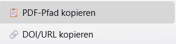

# Copy File Path – Zotero Plugin

Plugin für Zotero 9, das per Rechtsklick PDF-Dateipfade und DOIs/URLs ausgewählter Einträge in die Zwischenablage kopiert.



## Installation

1. Lade die neueste `.xpi`-Datei von den [Releases](https://github.com/JustusHenke/zotero-copy-path/releases) herunter
2. Öffne Zotero
3. Gehe zu `Extras` → `Add-ons`
4. Klicke auf das Zahnrad und wähle `Add-on-Datei installieren...`
5. Wähle die heruntergeladene `.xpi`-Datei aus
6. Starte Zotero neu, wenn erforderlich

## Verwendung

1. Wähle einen oder mehrere Einträge in Zotero aus
2. Rechtsklick → Kontextmenü:
   - **📋 PDF-Pfad kopieren** — kopiert Dateipfade aller `.pdf`-Anhänge
   - **🔗 DOI/URL kopieren** — kopiert `https://doi.org/…` (DOI bevorzugt, sonst URL)
3. Die Pfade/Links sind in der Zwischenablage und können mit `Strg+V` eingefügt werden

## Entwickler-Infos

### Projektstruktur

- `manifest.json` – Plugin-Metadaten und Kompatibilität
- `bootstrap.js` – Lifecycle-Hooks (Chrome-Registrierung, FTL)
- `copy-file-path.js` – Hauptlogik (MenuManager + Clipboard)
- `locale/de/` und `locale/en-US/` – Fluent-Lokalisierung
- `updates.json` – Auto-Update-Manifest
- `CHANGELOG.md` – Versionshistorie
- `README.md` – Diese Anleitung

### Build-Prozess

Um das Plugin als XPI-Datei zu packen:

1. Gehe in das Plugin-Verzeichnis
2. Zippe alle Dateien im Root-Ordner:

   ```bash
   zip -r copy-file-path.xpi manifest.json bootstrap.js copy-file-path.js README.md locale/
   ```

### Kompatibilität

- Zotero 9.0 oder neuer

## Lizenz

MIT
